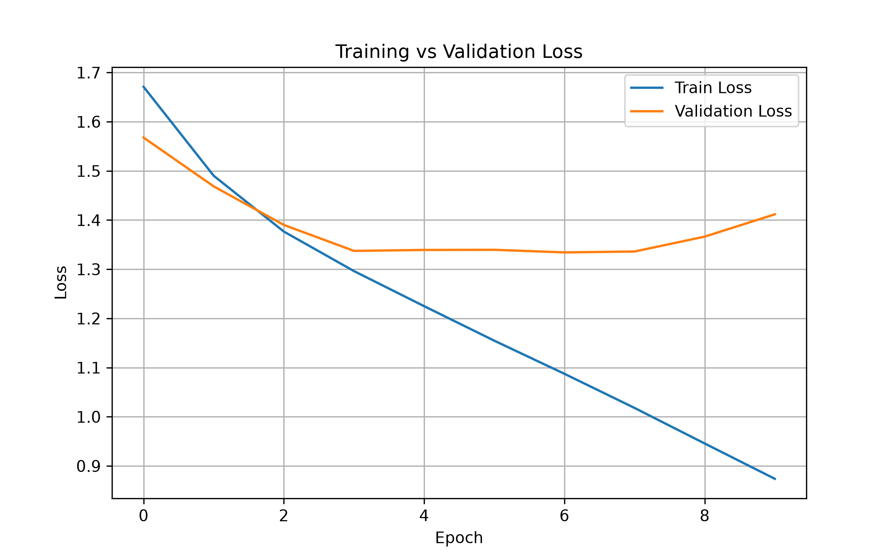
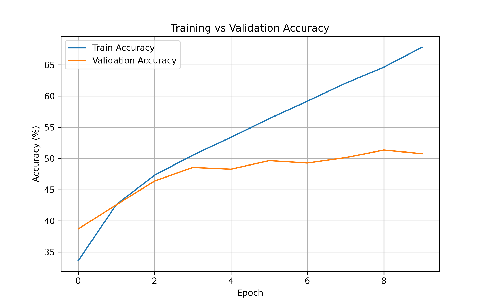
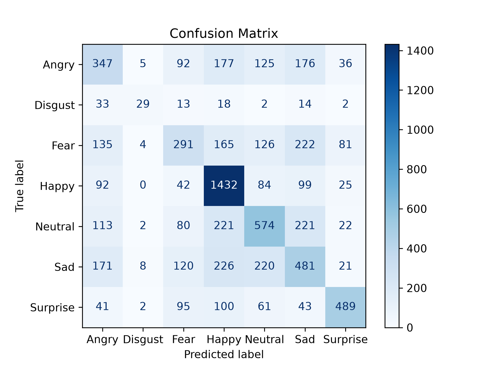

# 😀 DeepFER - Facial Emotion Recognition using Deep Learning

A Deep Learning project for recognizing human facial emotions from images using a Convolutional Neural Network (CNN) implemented in **PyTorch**.

The project was developed to understand the complete deep learning workflow—from loading data and building a CNN to training, evaluating, visualizing results, and preparing the model for deployment.

---

## 📌 Project Overview

Facial Emotion Recognition (FER) is an image classification problem where a model predicts the emotion displayed in a human face.

This project classifies facial expressions into the following seven emotions:

- 😠 Angry
- 🤢 Disgust
- 😨 Fear
- 😊 Happy
- 😐 Neutral
- 😢 Sad
- 😲 Surprise

The model is trained using the **FER-2013** dataset and implemented entirely in **PyTorch**.

---

# 🏗 Project Architecture

```
Dataset
    │
    ▼
DataLoader
    │
    ▼
Custom CNN
    │
    ▼
Training
    │
    ▼
Validation
    │
    ▼
Testing
    │
    ▼
Evaluation
    │
    ├── Accuracy
    ├── Loss Curves
    ├── Confusion Matrix
    └── Classification Report
```

---

# 📂 Project Structure

```
DeepFER/
│
├── dataset/
│
├── outputs/
│   ├── accuracy_curve.png
│   ├── loss_curve.png
│   ├── confusion_matrix.png
│   └── classification_report.txt
│
├── saved_models/
│   └── best_model.pth
│
├── src/
│   ├── config.py
│   ├── dataset.py
│   ├── engine.py
│   ├── evaluate.py
│   ├── metrics.py
│   ├── model.py
│   ├── plots.py
│   ├── predict.py
│   ├── train.py
│   └── utils.py
│
├── requirements.txt
├── README.md
└── .gitignore
```

---

# 🧠 CNN Architecture

The model consists of:

- Multiple Convolutional Layers
- ReLU Activation
- Max Pooling
- Fully Connected Layers
- Softmax Classification using CrossEntropyLoss

The model was implemented from scratch using PyTorch without relying on pretrained models.

---

# ⚙️ Technologies Used

- Python
- PyTorch
- TorchVision
- NumPy
- Matplotlib
- Scikit-Learn

---

# 📊 Model Evaluation

The project evaluates the CNN using:

- Test Accuracy
- Training Loss
- Validation Loss
- Training Accuracy
- Validation Accuracy
- Confusion Matrix
- Classification Report

---

# 📈 Results

### Test Accuracy

## 📉 Training Loss

<p align="center">
  
</p>

Although the model achieves strong performance on emotions such as **Happy** and **Surprise**, it struggles with **Fear**, **Sad**, and **Disgust** due to visual similarity between expressions and class imbalance in the dataset.

---

# 📉 Training Curves

<p align="center">
  
</p>

---

# 📈 Accuracy Curves

<p align="center">
  
</p>

---

# 📊 Confusion Matrix

<p align="center">
  
</p>

---

# 📋 Classification Report

The classification report includes:

- Precision
- Recall
- F1 Score
- Support

Example:

| Emotion | Precision | Recall | F1-score |
|----------|----------:|-------:|---------:|
| Angry | 0.37 | 0.36 | 0.37 |
| Disgust | 0.58 | 0.26 | 0.36 |
| Fear | 0.40 | 0.28 | 0.33 |
| Happy | 0.61 | 0.81 | 0.70 |
| Neutral | 0.48 | 0.47 | 0.47 |
| Sad | 0.38 | 0.39 | 0.38 |
| Surprise | 0.72 | 0.59 | 0.65 |

---

# 🚀 Installation
```

Move inside the project

```bash
cd DeepFER
```

Install dependencies

```bash
pip install -r requirements.txt
```

---

# ▶️ Training

```bash
python src/train.py
```

---

# 🧪 Evaluation

```bash
python src/evaluate.py
```

---

# 🔍 Predict Emotion

```bash
python src/predict.py
```

---

# 📚 What I Learned

Through this project I gained hands-on experience with:

- Building CNNs from scratch
- Image preprocessing
- PyTorch Dataset and DataLoader
- Forward and Backward Propagation
- Gradient Descent
- Model Evaluation
- Confusion Matrix
- Classification Report
- Modular Project Design
- Model Saving and Loading
- Software Engineering practices for ML projects

---

# 🔮 Future Improvements

- Transfer Learning (ResNet18 / EfficientNet)
- Data Augmentation
- Hyperparameter Tuning
- Early Stopping
- Learning Rate Scheduler
- Streamlit Web Application
- Docker Deployment

---

# 👨‍💻 Author

**Giridhar Sharma**

PGDM (Big Data Analytics)

Goa Institute of Management

---
